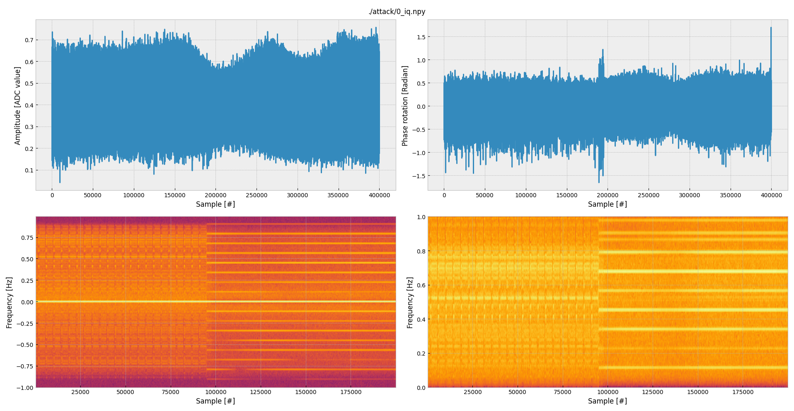
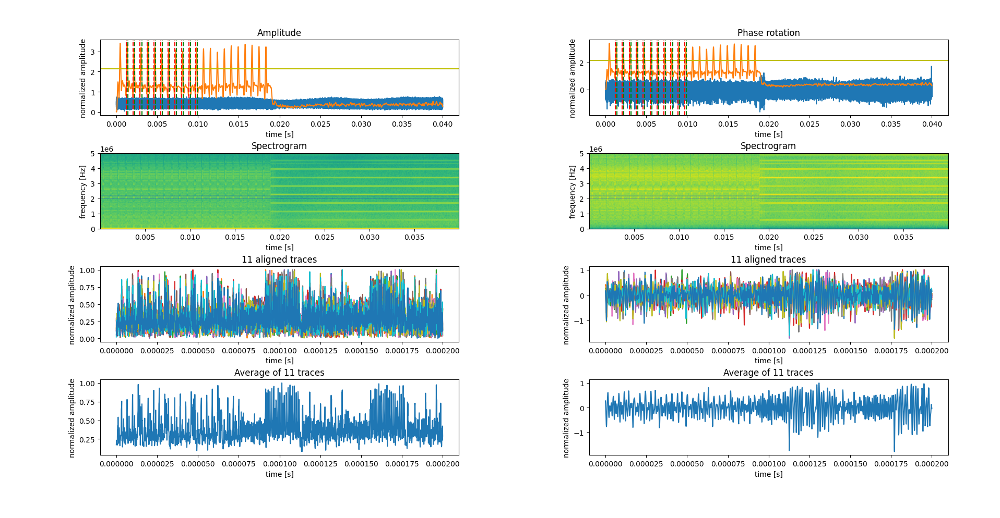

# Abstract

This artifact consists of software and data to reproduce the main results of section 7.2 of our paper.
The software is a research project (not production ready) and is composed of Python and C source code.
Everything is automated inside a Docker container, and dependencies and manual installation are referenced under the main project web page.
The data mainly consists of Numpy arrays containing complex numbers representing I/Q data.

# Introduction

This guide will help you reproduce the main results of our paper.
Note that this is a small part of our project.
The full project can be found on GitHub at [`pierreay/phase_data`](https://github.com/pierreay/phase_data/).

To fully reproduce this attack, in the first stage, one would have to first acquire a dataset using hardware by:
1. Flashing a firmware on the evaluated SoC (DUT) and installing the radio tooling.
2. Setup the experimental hardware, including the attacker host computer, the radio, the antenna and amplifiers, the DUT.
3. Performing a dataset collection (up to several hours) in a stable environment.

In a second stage, without any hardware:
4. Post-processing the dataset to extract amplitude and phase traces from the large raw I/Q signal.

As you imagine, this is fairly complex and long without prior experience.
Hence, in this guide, we provides representative datasets on which we can complete the step 4 of the entire attack, which do not require any hardware.
As such, we uploaded datasets on [Zenodo](https://zenodo.org/), an open platform for hosting research data:
> Ayoub (2025) PhaseSCA: XXX Dataset, Zenodo. DOI:
> XX.XXXX/zenodo.XXXXXXXX. URL: <https://zenodo.org/records/XXXXXXXX>

For every datasets, we will execute the following automatized steps:
- Performing an non-profiled side-channel attack (close to a Correlation Power Attack *a.k.a* CPA).
- Performing a profiled side-channel attack (close to a Template Attack *a.k.a* TA), composed of two steps:
    1. Creating a profile (*i.e.*, a template) from a training subset to learn the leakage model.
    2. Leveraging the profile, attack on an attack subset.

# Setup

First, we will setup necessary tools, downloading the code and the data.

## Download

Clone our repository (~ 100 MB) in the directory of your choice:

    git clone https://github.com/pierreay/phase_data/

Moreover, manually download the two aforementioned datasets located at [`zenodo.org/records/XXXXXXXX`](https://zenodo.org/records/XXXXXXXX) which have been publicly uploaded on Zenodo (~ XXX GB).

## Installation

We will setup a temporary Docker container for reproducing the attacks, in order to not clutter the host system.

First, ensure that both [Docker](https://www.docker.com/) and its [buildx](https://docs.docker.com/build/concepts/overview/) builder are installed on the host machine, following the host distribution documentation (for example on [Ubuntu](https://docs.docker.com/engine/install/ubuntu/) or [Arch Linux](https://wiki.archlinux.org/title/Docker)).

Second, move the downloaded datasets inside the Docker folder:

    cd phase_data/docs/2025-01-23_tches-artifact
    mv -t . /PATH/TO/DOWNLOADED/XXX.tar.bz2

Third, download and initialize the Docker image leveraging the `Dockerfile`:

    make build

It will download around XXX GB and decompress the datasets that have been downloaded previously inside the container.
The image and containers will be cleaned up at the end, no files will be left or modified on the host system.

The Docker should now be ready to be used.
In the following, we assume that the reader is connected to the Docker container through SSH by running:

    make shell

Note that you can use the `DOCKER_LMOUNT` variable to mount the directory from the host containing the datasets:

    make shell DOCKER_LMOUNT=/PATH/TO/phase_data/sets

The X11 display should be shared between the container and the host.
To test this, one may run:

    xclock

If the clock is displayed, good to go.
If an error of the type `Authorization required, but no authorization protocol specified` arise, run the following on the host system:

    sudo xhost +local:docker=

Exit and restart the Docker container, and the X11 display sharing should work.


# Reproducing the attacks

## nRF52

For our first attacks, we propose to attack the nRF52, a wide-spread SoC in the IoT ecosystem.

### Attacking nRF52 with non-profiled attack

We will first perform a non-profiled attack (easier compared to a profiled attack) to reproduce our Figure 12.a of the paper.

First, move to the dataset directory and extract the I/Q signals:

```bash
cd /home/rootless/host_sets/24-07-04_nrf52-ref
tar xvf attack.tar
```

For future reference, here are the meanings of all the directories:
- `attack`    : Original collected raw attack set.
- `attack_*`  : Post-processed and filtered attack set(s).
- `train`     : Original collected raw train set.
- `train_*`   : Post-processed and filtered train set(s).
- `bin`       : Binaries (e.g., firmware flashed on DUT).
- `csv_*`     : CSVs containing attack results (used for plotting paper figures).
- `logs_*`    : Text files containing attack logging.
- `plots_*`   : Plots of attack results based on CSVs.
- `profile_*` : Template used for profiled attacks based on a specific post-processing train set.
- `src`       : Scripts used to build, process and attack the dataset.

Since our tools were improved during the research process, sometimes without backward compatibility, we will sometimes have to checkout the correct versions of our tools for this dataset.
Let's do this for the post-processing:

```bash
./src/git-checkout.sh process
```

One may visually inspect a single trace in complex numbers format (storing IQ data, *i.e.*, a complex-valued signal) by running the following command:

```bash
soapyrx plot ./attack/0_iq.npy
```

This will plot you different components of the trace at index 0:



In this plot, you can see:
1. The first row showing the amplitude on the left and the phase on the right, both in time domain.
1. The second row showing the spectrogram for the I/Q on the left, and the spectrogram (*i.e.*, frequency domain representation) for the phase component on the right.
Note the symmetry (amplitude/phase) in the first row that is not true in the second row (IQ/phase).

This IQ recording is the direct output of our SDR during signal acquisition, without any further post-processing.
Hence, it contains both the amplitude and phase information that are exploited separately in the paper.

As explained in the Section 7.2 from our paper, we will use filters to isolate the amplitude-modulated and phase-modulated signals.
During our experiments, this was automated by the `src/process.sh` script with different filters, but to use the one of the paper, one may run the following commands:

```bash
mkdir -p attack_filt_lh1e6
cp -t attack_filt_lh1e6 attack/pt.txt attack/key.txt
./src/process_filt.py attack attack_filt_lh1e6 src/collect.toml lh1e6
```

The following plots may vary depending on the version (*i.e.*, commit) of `scaff` that have been checkout by the `git-checkout.sh` script.
For the latest version, this is an example plot that show you a preview of what will be extracted:



In this plot, you can see the amplitude extraction on the left side, and the phase extraction on the right side.
All signals (for both time-domain and frequency-domain) are shown after the filtering stage and the amplitude / phase conversion, so no IQ data is shown on this plot.
1. On the first row, you can see the signal acquired with our SDR in the time-domain, where each green and red dashed lines represent the boundaries (beginning and the end) of the final extracted traces.
2. On the second row, you can see the same signal as the first row but in the frequency domain in function of time (spectrogram).
3. On the third row, you can see how each extracted traces align themselves.
4. On the fourth and final row, you can see the resulting extracted trace, averaged from the aligned traces of the third row.

You can quit the plot by hitting `q`, and the post-processing will begin.
This will post-process our I/Q data from the `attack` directory and storing the result into the `attack_filt_lh1e6` directory, extracting traces for the side-channel attack, using a high-pass filter of 1 MHz for the amplitude traces and a low-pass filter of 1 MHz for the phase traces.
The filters width have been determined experimentally by trial and error and is specific to each DUT model.
A visual inspection of the leakage in the frequency domain give the attacker a first approximation of the correct width to use.
By default, it will process 2000 for this dataset, but you can stop it manually at 800/2000 processed traces by hitting CTRL+C (because we already know from our paper that 800 traces is sufficient to perform a full key recovery).

One may visually inspect a single or multiples post-processed trace(s) in float numbers format (real-valued trace) by running the following command:

```bash
scaff show --base 0 --offset 3 --cumulative attack_filt_lh1e6 phr
```


On this plot, you can see the 3 first phase shift traces of the dataset plotted on the same plot.
Those traces are obtained by the post-processing, which perform signal alignment, averaging, and demodulation, *i.e.*, going from a complex-valued signal to a real-valued trace representing the amplitude or the phase.
One may notice that they are perfectly aligned, which is required to have a successful attack.
You can use `amp` instead of `phr` to visualize amplitude traces instead of phase shift traces.
Moreover, you can use `scaff show --help` to display the help.

Now, we want to start attacking using a Correlation Radio Analysis (CRA), let's checkout the version of our tools needed to do this:

```bash
./src/git-checkout.sh attack_cra
```

We can now proceed to a single attack using 150 amplitude traces, by running the following:

```bash
scaff --log --loglevel INFO cra --no-plot --norm --data-path attack_filt_lh1e6 --start-point 0 --end-point 0 --num-traces 150 --no-bruteforce --comp amp
```

It will display a first plot of all traces to ensure that they are correctly aligned, as well as a second plot with the resulting average.
The attack will then start by attacking each subkey (*i.e.*, key bytes) individually, which can take from 10 seconds for a hundred of traces to several minutes for thousands of traces.
At the end, you should see the following result:

```txt
Best Key Guess:   2c   36   5e   69   6d   7e   aa   de   6a   cd   3f   4f   a2   c0   94   3a
Known Key:        2c   36   dd   69   6d   85   76   de   96   cd   3f   4f   89   76   94   6a
PGE:             000  000  109  000  000  001  055  000  007  000  000  000  030  001  000  094
HD:              000  000  003  000  000  007  005  000  006  000  000  000  004  005  000  002
SUCCESS:           1    1    0    1    1    0    0    1    0    1    1    1    0    0    1    0
NUMBER OF CORRECT BYTES: 9
HD SUM:                  32

Starting key ranking using HEL
results rank estimation
nb_bins = 512
merge = 2
Starting preprocessing
Clearing memory
min: 2^49.09905512
actual rounded: 2^49.55726301
max: 2^49.92155851
time enum: 0.257056 seconds
```

This shows the guessed key using the side-channel, the actual known key, and different metrics from the attack (Correct bytes, Hamming Distance (HD), Partial Guess Entropy (PGE), Key Rank).
In this example, we have an estimated key rank of 2^49, which means that after our attack, we still have to test 2^49 keys before finding the correct key.
In other words, we reduced the AES key space from 128 bits to 49 bits.
This result corresponds to the point of 150 traces in Figure 12.a.

You can now try with other traces instead of amplitude traces, like in the core contribution of our paper, the `phr` parameter for the phase traces and the `recombined` parameter for the Multi-Channel Fusion Attack (MCFA), which recombines the amplitude and phase traces to improve the results compared to traditional attacks.

```bash
scaff --log --loglevel INFO cra --no-plot --norm --data-path attack_filt_lh1e6 --start-point 0 --end-point 0 --num-traces 150 --no-bruteforce --comp phr
```

```text
Best Key Guess:   2c   fc   dd   69   c2   85   76   de   96   cd   3f   4f   89   86   70   6a
Known Key:        2c   36   dd   69   6d   85   76   de   96   cd   3f   4f   89   76   94   6a
PGE:             000  001  000  000  006  000  000  000  000  000  000  000  000  009  001  000
HD:              000  004  000  000  006  000  000  000  000  000  000  000  000  004  004  000
SUCCESS:           1    0    1    1    0    1    1    1    1    1    1    1    1    0    0    1
NUMBER OF CORRECT BYTES: 12
HD SUM:                  18

Starting key ranking using HEL
results rank estimation
nb_bins = 512
merge = 2
Starting preprocessing
Clearing memory
min: 2^19.44428495
actual rounded: 2^19.95336239
max: 2^20.35668945
time enum: 0.353109 seconds
```

As you can see, we have in this attack a key rank of 2^19 using phase traces.

One may use the `--bruteforce` flag to bruteforce the key in a few seconds at the end of the attack, and perform a full key recovery:

```bash
scaff --log --loglevel INFO cra --no-plot --norm --data-path attack_filt_lh1e6 --start-point 0 --end-point 0 --num-traces 150 --bruteforce --comp phr
```

```text
Starting preprocessing
current rank : 2^1
current rank : 2^1.584962501
current rank : 2^2.584962501
current rank : 2^3.321928095
current rank : 2^4.169925001
current rank : 2^5.129283017
current rank : 2^6.022367813
current rank : 2^7.139551352
current rank : 2^8.124121312
current rank : 2^9.103287808
current rank : 2^10.09671515
current rank : 2^11.01611184
current rank : 2^12.03204573
current rank : 2^13.01941698
current rank : 2^14.08870544
current rank : 2^15.01902598
current rank : 2^16.03206726
current rank : 2^17.01976445
current rank : 2^18.09110476
current rank : 2^19.03235519

KEY FOUND!!!
2c 36 dd 69 6d 85 76 de 96 cd 3f 4f 89 76 94 6a
```

But we can do even better using MCFA, which recombines the information from the amplitude traces and from the phase traces inside a single attack:

```bash
scaff --log --loglevel INFO cra --no-plot --norm --data-path attack_filt_lh1e6 --start-point 0 --end-point 0 --num-traces 150 --no-bruteforce --comp recombined
```

```text
[scaff] [INFO] Perform recombination...
Best Key Guess:   2c   36   dd   69   6d   85   76   de   96   cd   3f   4f   89   c0   94   6a
Known Key:        2c   36   dd   69   6d   85   76   de   96   cd   3f   4f   89   76   94   6a
PGE:             000  000  000  000  000  000  000  000  000  000  000  000  000  001  000  000
HD:              000  000  000  000  000  000  000  000  000  000  000  000  000  005  000  000
SUCCESS:           1    1    1    1    1    1    1    1    1    1    1    1    1    0    1    1
NUMBER OF CORRECT BYTES: 15
HD SUM:                  5

Starting key ranking using HEL
results rank estimation
nb_bins = 512
merge = 2
Starting preprocessing
Clearing memory
min: 2^2
actual rounded: 2^3.321928095
max: 2^4.087462841
time enum: 0.310211 seconds
```

The key rank is of 2^3, which means that we have 8 keys to test before finding the correct one after our side-channel attack, which attacked a 128 bits AES key.

## <!--TODO: Adaptation to PhaseSCA from BlueScream-->

For the following command, the `$SC_SRC` variable is set to the path of the `screaming_channels_ble/src` directory, while the `$DATASET` variable will be set to the path of the currently analyzed dataset.

### Attacking $A_{7}$

This dataset correspond to the scenario with the non-instrumented firmware in the anechoic box.

Set the path to the dataset:

    export DATASET="/240207_1-leak-pairing-10cm-anechoic-2.533e9-8e6_raw"

First, create the profile:

    "${SC_SRC}/attack.py" --dataset-path "${DATASET}" --custom-dtype --plot \
                          --save-images --norm --comptype AMPLITUDE \
                          --num-traces 16384 --start-point 1000 --end-point 1500 \
                          profile --pois-algo r --num-pois 1 --poi-spacing 1 \
                          --variable p_xor_k --align

Where non-obvious options means:
- **custom-dtype:** Use a custom `dtype` instead of the default Numpy complex `dtype`, allowing to save disk space.
- **norm:** Normalize the traces after loading.
- **start-point / &#x2013;end-point:** Truncate the traces between those points.
- **pois-algo:** Use the $k-\text{fold}$ $\rho-\text{test}$ to find informative point of interests (PoIs).
- **num-pois:** Use only 1 PoI per subbytes.
- **variable p_xor_k:** Use the $l = p \oplus k$ leakage variable, with $p$ the plaintext and $k$ the key.

At that point, a plot should open (if X11 forwarding is correctly configured with Docker) and the profile will be stored under `${DATASET}/profile`.
If no plot appears, check that the profile has correctly been created by running:

    evince ${DATASET}/profile/*.pdf

You should obtains plots similar to the following ones:

<!---->

<!---->

We will now attack using the created profile:

    "${SC_SRC}"/attack.py --dataset-path "${DATASET}" --custom-dtype --log \
               --plot --norm --bruteforce --comptype AMPLITUDE \
               --start-point 1000 --end-point 1500 --num-traces 14900 \
               attack --attack-algo pcc --profile "${DATASET}/profile" --num-pois 1 \
               --poi-spacing 1 --variable p_xor_k --align-attack --align-profile \
               --no-align-profile-avg

The options are fairly similar to the previous command, except that we also specify to bruteforce the key at the end, and to re-perform a step of trace alignment.
You should see this output:

    Best Key Guess:   7c   19   67   e4   41   65   da   6d   f5   18   32   f7   c5   f1   13   3e
    Known Key:        7f   18   67   e6   42   65   da   6f   f5   1b   32   f4   c6   f3   10   3e
    PGE:             002  001  000  003  001  000  000  003  000  003  000  003  002  002  001  000
    HD:              002  001  000  001  002  000  000  001  000  002  000  002  002  001  002  000
    SUCCESS:           0    0    1    0    0    1    1    0    1    0    1    0    0    0    0    1
    CORRECT BYTES: 6
    PGE MEAN:      1
    PGE MEDIAN:    1
    PGE MAX:       3
    HD SUM:        16
    
    Starting key ranking using HEL
    results rank estimation
    nb_bins = 512
    merge = 2
    Starting preprocessing
    Clearing memory
    min: 2^33.79125918
    actual rounded: 2^34.59872304
    max: 2^35.23080812
    time enum: 0.343729 seconds

Which means that this attack leads to an estimated key rank of $2^{34}$, just as $A_{7}$ in the paper.

With the additional bruteforce, which took 1,5 hours running natively on my desktop computer but a little more inside the Docker container, you should obtain:

    Starting key enumeration using HEL
    Assuming that we know two plaintext/ciphertext pairs
    [...]
    Starting preprocessing
    current rank : 2^2.584962501
    current rank : 2^4.459431619
    [...]
    current rank : 2^33.13069245
    current rank : 2^34.11663176
    
    KEY FOUND!!!
    7f 18 67 e6 42 65 da 6f f5 1b 32 f4 c6 f3 10 3e

Which means we break the entire key!

# Clean

Finally, once the Docker container is exited, one may run the following to clean the image:

    make clean

# Conclusion

In this demonstration, we reproduced the two most important results of the paper regarding attack performances.
All other claims can also be reproduced by leveraging our full dataset repository, including scripts and data.
Regarding the protocol manipulation part of the attack, a better solution would be to have an online platform allowing to replicate and extend such attacks.
We are looking into this as future work.
